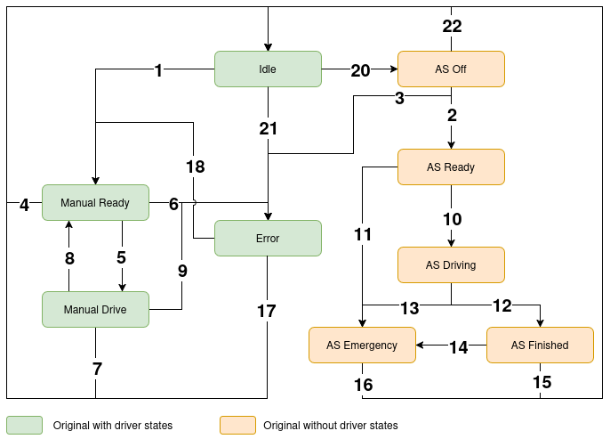

# README for the VCU State Machine

## General

In this document some documentation of the internal structure of the state machine is provided so that it is easier to understand and maintain. 

> [!caution]
> The provided implementation is designed based on the 2025 rules from [Formula Student Germany](https://www.formulastudent.de/fileadmin/user_upload/all/2025/rules/FS-Rules_2025_v1.1.pdf). Keep in mind that rules a constantly changing and that we cannot assure that the implementation is still rules compliant.

## Output Messages

The state machine publishes 3 message types in regular time distances:

1. [VehicleState.msg](../vcu_msgs/msg/VehicleState.msg): 
    - contains all important messages that are processed by other nodes 
    - is needed by the vcu node for vehicle operation
2. [VehicleStateDebug.msg](../vcu_msgs/msg/VehicleStateDebug.msg):
    - contians information helpful for debugging
3. [VehicleStateReadable.msg](../vcu_msgs/msg/VehicleStateReadable.msg):
    - contains the most important message parts as string for easy readability

## State Transitions

### State Descriptions

**0 - Idle:**
- State description:
  - SDC: on, can be closed
  - ASMS: off
  - TS: off
  - Mission Selected: can be selected
  - Inverters: disabled (= set torques to 0, setpoints to 500?)
  - AMS: Idle
  - Else: no errors present

**1 - AS Off:**
- State description:
  - SDC: on, can be closed
  - ASMS: on or off
  - TS: off
  - Mission Selected: can be selected
  - Inverters: disabled (= set torques to 0, setpoints to 500?)
  - AMS: Idle
  - Else: no errors present

**2 - AS Ready:**
- State description:
  - SDC: closed
  - ASMS: on
  - TS: activated
  - Mission Selected: true
  - Inverters: disabled
  - AMS: Drive
  - Else: no errors present and Initial EBS Checkup successfully finished

**3 - AS Drive:**
- State description:
  - SDC: closed
  - ASMS: on
  - TS: activated
  - Mission Selected: true
  - Inverters: enabled
  - AMS: Drive
  - Else: no errors, continuous EBS checks

**4 - AS Finished:**
- State description:
  - SDC: on, open
  - ASMS: on
  - TS: off
  - Mission Selected: true
  - Inverters: disabled
  - AMS: Idle
  - Else: finish signal received from AS system

**5 - AS Emergency:**
- State description:
  - SDC: off
  - ASMS: on
  - TS: off
  - Mission Selected: true
  - Inverters: deactivated
  - AMS: Idle
  - Else: SDC opened by VCU or RES

**6 - Manual Ready:**
- State description:
  - SDC: closed
  - ASMS: off
  - TS: activated
  - Mission Selected: true
  - Inverters: disabled
  - AMS: Drive
  - Else: no errors despite inverter errors; SSB Rear, PDU, DIS timeouts allowed

**7 - Manual Drive:**
- State description:
  - SDC: closed
  - ASMS: off
  - TS: activated
  - Mission Selected: true
  - Inverters: enabled
  - AMS: Drive
  - Else: no errors despite inverter errors; SSB Rear, PDU, DIS timeouts allowed

**8 - Error:**
- State description:
  - SDC: off
  - ASMS: on or off
  - TS: off
  - Mission Selected: can be selected
  - Inverters: disabled
  - AMS: Idle
  - Else: errors present or not reset

---

### State Transitions

**1 - AS Idle → Manual Ready:**
- Preconditions:
  - Manual mission selected
  - ASMS: off
  - SDC: closed
  - No errors (except inverter errors; SSB Rear, DIS timeouts allowed)
- State change trigger:
  - Press internal TS button

**2 - AS Off (Idle) → AS Ready:**
- Preconditions:
  - AS mission selected
  - ASMS: on
  - SDC: closed
  - Initial EBS check successfully finished
  - No errors (except inverter errors; SSB Rear, DIS timeouts allowed)
- State change trigger:
  - Press external TS button

**3 - AS Off (Idle) → Error:**
- Preconditions:
  - —
- State change trigger:
  - Errors present (CAN timeouts or plausibility errors)

**AS Off (Idle) → Other States:**
- Manual Drive: NO TRANSITION  
- AS Drive: NO TRANSITION  
- AS Finish: NO TRANSITION  
- AS Emergency: NO TRANSITION  

---

**4 - Manual Ready → AS Off (Idle):**
- Preconditions:
  - —
- State change triggers:
  - Press TS button (~1s)
  - Press shutdown button (open SDC)

**5 - Manual Ready → Manual Drive:**
- Preconditions:
  - Option 1:
    - AMS: Drive
    - Inverter: no errors
    - Inverter speed: < 5
    - Brake pressure front: > 5
  - Option 2:
    - AMS: Drive
    - Brake pressure front: > 5
- State change triggers:
  - Option 1: press R2D button
  - Option 2: press R2D button ≥ 3s

**6 - Manual Ready → Error:**
- Preconditions:
  - —
- State change triggers:
  - PDU CAN timeout
  - APPS implausibility (APPS1/APPS2)
  - Brake pressure sensor errors (front/rear)
  - CAN timeout BSE
  - CAN timeout AMS
  - Brake force sensor error

**Manual Ready → Other States:**
- AS Ready: NO TRANSITION  
- AS Drive: NO TRANSITION  
- AS Finish: NO TRANSITION  
- AS Emergency: NO TRANSITION  

---

**7 - Manual Drive → AS Off (Idle):**
- Preconditions:
  - —
- State change triggers:
  - Open SDC (e.g. shutdown button)
  - Press TS button (~1s)

**8 - Manual Drive → Manual Ready:**
- Preconditions:
  - —
- State change trigger:
  - Press R2D button (~1s)

**9 - Manual Drive → Error:**
- Preconditions:
  - —
- State change triggers:
  - Same as Manual Ready → Error

**Manual Drive → Other States:**
- AS Ready: NO TRANSITION  
- AS Drive: NO TRANSITION  
- AS Finish: NO TRANSITION  
- AS Emergency: NO TRANSITION  

---

**10 - AS Ready → AS Drive:**
- Preconditions:
  - Waited 5 seconds
  - EBS state: armed
  - No errors (except allowed ones)
- State change trigger:
  - Press RES Go button

**11 - AS Ready → AS Emergency:**
- Preconditions:
  - —
- State change triggers:
  - ASMS off
  - SDC open
  - Errors present
  - AMS not in Drive
  - EBS not armed
  - DV timeout

**AS Ready → Other States:**
- All: NO TRANSITION  

---

**12 - AS Drive → AS Finish:**
- Preconditions:
  - EBS state: armed
  - Inverter speed: 0
- State change trigger:
  - DV PC sends "finished mission"

**13 - AS Drive → AS Emergency:**
- Preconditions:
  - —
- State change triggers:
  - Same as AS Ready → AS Emergency

**AS Drive → Other States:**
- All: NO TRANSITION  

---

**14 - AS Finish → AS Emergency:**
- Preconditions:
  - —
- State change triggers:
  - SDC open
  - Errors present
  - AMS in Drive
  - DV timeout

**15 - AS Finish → Idle:**
- Preconditions:
  - ASMS off
- State change trigger:
  - Brake pressure < 0.5 bar

**AS Finish → Other States:**
- All: NO TRANSITION  

---

**16 - AS Emergency → AS Off (Idle):**
- Preconditions:
  - Waited 10 seconds
  - ASMS off
- State change trigger:
  - Brake pressure < 0.5 bar

**AS Emergency → Other States:**
- All: NO TRANSITION  

---

**17 - Error → AS Idle:**
- Preconditions:
  - No errors present
- State change trigger:
  - Press R2D button (VCU reset)

**18 - Error → Manual Ready:**
- Preconditions:
  - No errors (except allowed ones)
- State change trigger:
  - Press TS button

**Error → Other States:**
- All: NO TRANSITION  

---

**20 - Idle → AS Off:**
- Preconditions:
  - —
- State change trigger:
  - EBS pressure 1 & 2 > threshold (e.g. 5 bar)